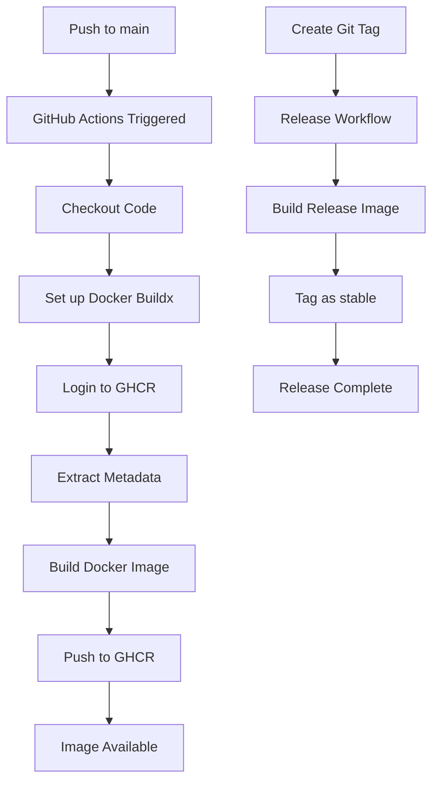

# GitHub Actions Workflow Plan for StepDaddyLiveHD

## Overview
This document outlines the implementation plan for a GitHub Actions workflow that builds, versions, and publishes the StepDaddyLiveHD container to GitHub Container Registry (GHCR).

## Project Analysis
- **Application Type**: Reflex-based Python IPTV proxy
- **Container**: Multi-stage Docker build with Python 3.13, Caddy, and Redis
- **Current State**: No existing GitHub Actions workflows
- **Target Registry**: GitHub Container Registry (GHCR)

## Workflow Strategy

### 1. Trigger Events
- Push to `main` branch
- Pull requests (for testing builds)
- Manual workflow dispatch
- Git tags (for releases)

### 2. Versioning Strategy
- **Latest Tag**: Always points to the most recent successful build
- **Git Tags**: Semantic versioning (e.g., `v1.0.0`, `v1.1.0`)
- **Commit SHA**: Unique identifier for each build
- **Branch Names**: For development branches

### 3. Multi-Platform Support
- **AMD64**: Primary architecture
- **ARM64**: Optional for broader compatibility

### 4. Build Arguments
Based on your Dockerfile, the workflow will support:
- `PORT`: Custom port (default: 3000)
- `API_URL`: Domain/IP where server is reachable
- `PROXY_CONTENT`: Proxy video content (default: TRUE)
- `SOCKS5`: SOCKS5 proxy configuration

## Workflow Implementation Plan

### Step 1: Create Directory Structure
```
.github/
└── workflows/
    ├── build-and-publish.yml    # Main workflow
    └── release.yml              # Release-specific workflow
```

### Step 2: Main Workflow (build-and-publish.yml)
```yaml
name: Build and Publish Container

on:
  push:
    branches: [ main ]
  pull_request:
    branches: [ main ]
  workflow_dispatch:

env:
  REGISTRY: ghcr.io
  IMAGE_NAME: ${{ github.repository }}

jobs:
  build-and-push:
    runs-on: ubuntu-latest
    permissions:
      contents: read
      packages: write
    
    steps:
    - name: Checkout repository
      uses: actions/checkout@v4
    
    - name: Set up Docker Buildx
      uses: docker/setup-buildx-action@v3
    
    - name: Log in to Container Registry
      uses: docker/login-action@v3
      with:
        registry: ${{ env.REGISTRY }}
        username: ${{ github.actor }}
        password: ${{ secrets.GITHUB_TOKEN }}
    
    - name: Extract metadata
      id: meta
      uses: docker/metadata-action@v5
      with:
        images: ${{ env.REGISTRY }}/${{ env.IMAGE_NAME }}
        tags: |
          type=ref,event=branch
          type=ref,event=pr
          type=semver,pattern={{version}}
          type=semver,pattern={{major}}.{{minor}}
          type=sha,prefix={{branch}}-
          type=raw,value=latest,enable={{is_default_branch}}
    
    - name: Build and push Docker image
      uses: docker/build-push-action@v5
      with:
        context: .
        push: ${{ github.event_name != 'pull_request' }}
        tags: ${{ steps.meta.outputs.tags }}
        labels: ${{ steps.meta.outputs.labels }}
        platforms: linux/amd64,linux/arm64
        cache-from: type=gha
        cache-to: type=gha,mode=max
        build-args: |
          PORT=3000
          PROXY_CONTENT=TRUE
```

### Step 3: Release Workflow (release.yml)
```yaml
name: Release

on:
  push:
    tags:
      - 'v*'

env:
  REGISTRY: ghcr.io
  IMAGE_NAME: ${{ github.repository }}

jobs:
  release:
    runs-on: ubuntu-latest
    permissions:
      contents: read
      packages: write
    
    steps:
    - name: Checkout repository
      uses: actions/checkout@v4
    
    - name: Set up Docker Buildx
      uses: docker/setup-buildx-action@v3
    
    - name: Log in to Container Registry
      uses: docker/login-action@v3
      with:
        registry: ${{ env.REGISTRY }}
        username: ${{ github.actor }}
        password: ${{ secrets.GITHUB_TOKEN }}
    
    - name: Extract metadata
      id: meta
      uses: docker/metadata-action@v5
      with:
        images: ${{ env.REGISTRY }}/${{ env.IMAGE_NAME }}
        tags: |
          type=ref,event=tag
          type=semver,pattern={{version}}
          type=semver,pattern={{major}}.{{minor}}
          type=raw,value=stable
    
    - name: Build and push Docker image
      uses: docker/build-push-action@v5
      with:
        context: .
        push: true
        tags: ${{ steps.meta.outputs.tags }}
        labels: ${{ steps.meta.outputs.labels }}
        platforms: linux/amd64,linux/arm64
        build-args: |
          PORT=3000
          PROXY_CONTENT=TRUE
```

## Configuration Requirements

### 1. Repository Settings
- Enable GitHub Actions in repository settings
- Ensure `GITHUB_TOKEN` has write permissions for packages

### 2. Environment Variables
The workflow will use these default build arguments:
- `PORT=3000`
- `PROXY_CONTENT=TRUE`
- `API_URL` (can be set via repository secrets if needed)
- `SOCKS5` (can be set via repository secrets if needed)

### 3. Git Tags for Releases
To create a release, push a tag:
```bash
git tag v1.0.0
git push origin v1.0.0
```

## Usage Instructions

### 1. Pull the Image
```bash
docker pull ghcr.io/your-username/stepdaddylivehd:latest
```

### 2. Run the Container
```bash
docker run -p 3000:3000 ghcr.io/your-username/stepdaddylivehd:latest
```

### 3. Use Specific Version
```bash
docker pull ghcr.io/your-username/stepdaddylivehd:v1.0.0
```

## Benefits of This Implementation

1. **Automated Builds**: Every push to main triggers a new build
2. **Version Management**: Semantic versioning with git tags
3. **Multi-platform**: Supports both AMD64 and ARM64
4. **Caching**: Fast builds with GitHub Actions cache
5. **Security**: Uses GitHub's built-in authentication
6. **Flexibility**: Configurable build arguments
7. **Reliability**: Proper error handling and permissions

## Next Steps

1. Switch to Code mode to implement the workflow files
2. Test the workflow with a sample build
3. Create documentation for usage
4. Set up any additional repository secrets if needed

## Mermaid Diagram



This plan provides a comprehensive GitHub Actions workflow for your StepDaddyLiveHD project that will automatically build, version, and publish your container to GHCR.